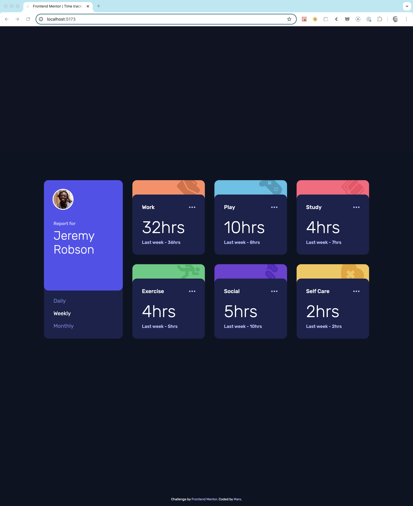
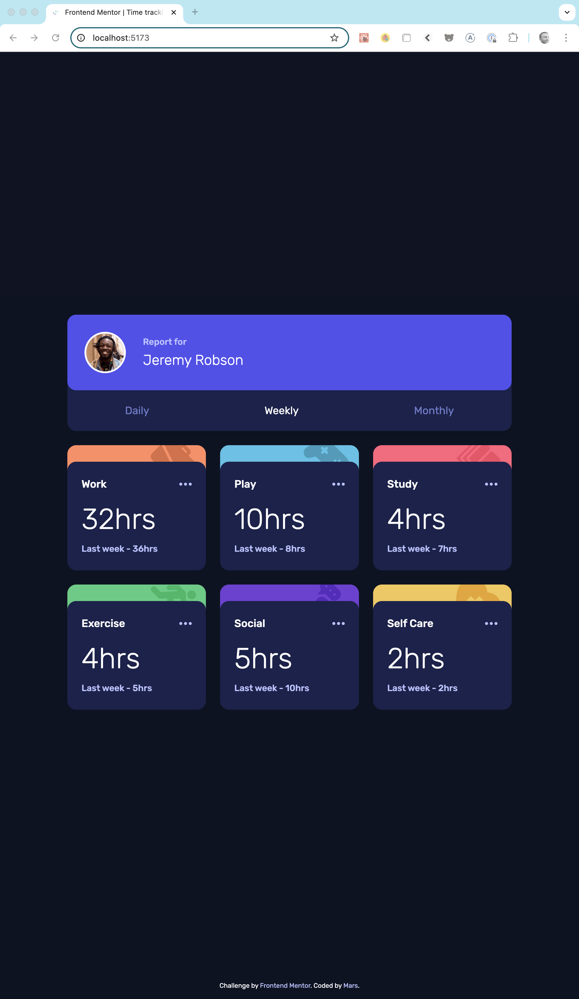
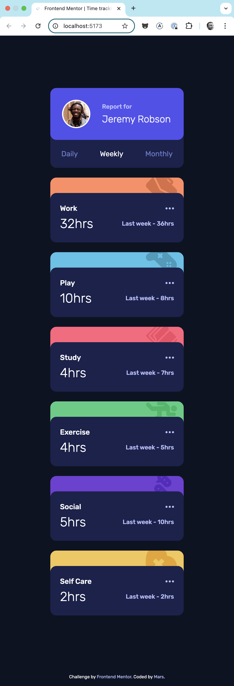

# Frontend Mentor - Time tracking dashboard solution

This is a solution to the [Time tracking dashboard challenge on Frontend Mentor](https://www.frontendmentor.io/challenges/time-tracking-dashboard-UIQ7167Jw). Frontend Mentor challenges help you improve your coding skills by building realistic projects.

## Table of contents

- [Overview](#overview)
  - [The challenge](#the-challenge)
  - [Screenshot](#screenshot)
  - [Links](#links)
- [My process](#my-process)
  - [Built with](#built-with)
  - [What I learned](#what-i-learned)
  - [Continued development](#continued-development)
  - [Useful resources](#useful-resources)
- [Author](#author)

## Overview

### The challenge

Users should be able to:

- View the optimal layout for the site depending on their device's screen size
- See hover states for all interactive elements on the page
- Switch between viewing Daily, Weekly, and Monthly stats

### Screenshot

#### 🖥️ Desktop



#### 📱 Tablet



#### 📱 Mobile



### Links

- Solution URL: [Add solution URL here](https://your-solution-url.com)
- Live Site URL: [Add live site URL here](https://your-live-site-url.com)

## My process

### Built with

- Semantic HTML5 markup
- CSS custom properties
- Flexbox
- CSS Grid
- Mobile-first workflow
- [React](https://reactjs.org/) - JS library
- [Styled Components](https://styled-components.com/) - For styles

### What I learned

This project helped reinforce responsive design techniques using CSS Grid and `clamp()` for fluid typography. I also gained confidence using `styled-components` for dynamic styling in React.

Example:

```ts
const ActualTracking = styled.p`
  font-size: clamp(1rem, 4vw, 2rem);
`;
```

### Continued development

I’d like to explore techniques for dynamic theme switching using styled-components’ ThemeProvider.

### Useful resources

- CSS Tricks - clamp()
- Frontend Mentor community
- Styled Components docs

## Author

- Frontend Mentor - [@martinianol](https://www.frontendmentor.io/profile/martinianol)
- Github - [@martinianol](https://github.com/martinianol)
